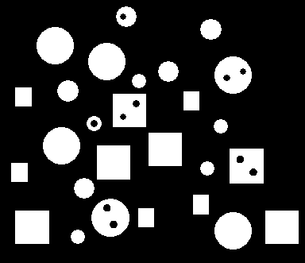
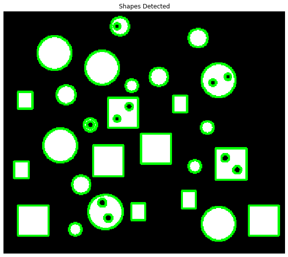
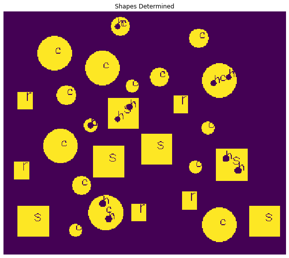

# Shape-Detector
This is a image processing task accomplished with the help of OPENCV and python.

## The input image looks something like this.

## The shape detection stage
At this point the open cv detects the different shapes. it does not label them for rectangle or square ... it just finds them on the image.

## The output Image:

different letters are for different shapes for example: r for rectange, c for circle, s for square and h for hole(you need to look cloesely for that it might look like an h
